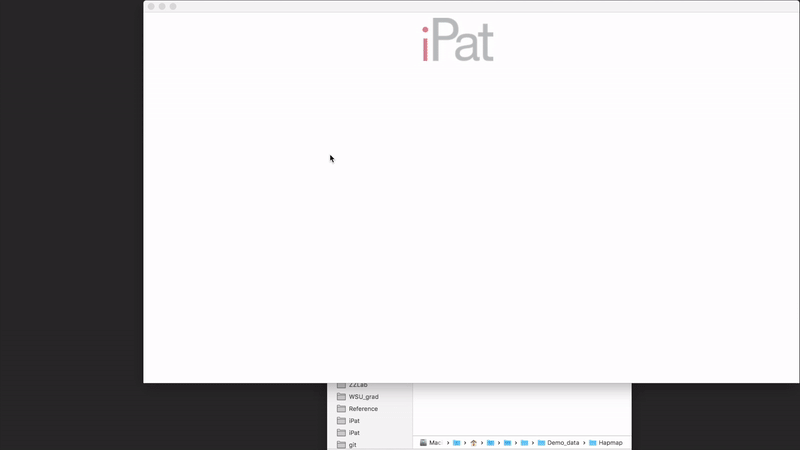
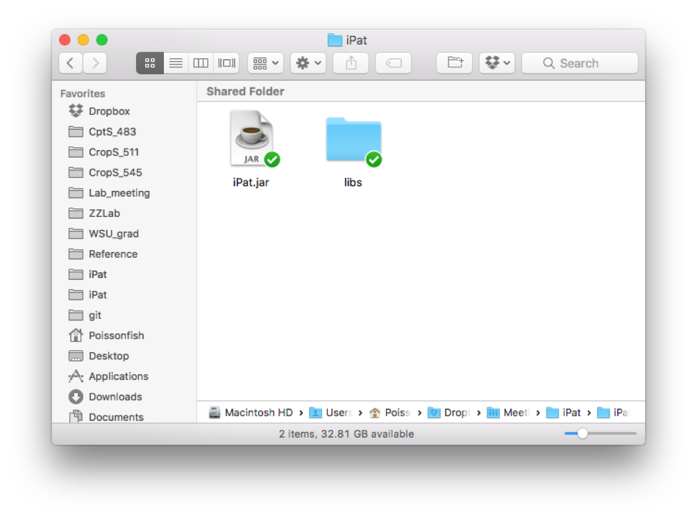
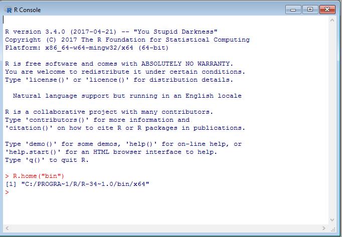
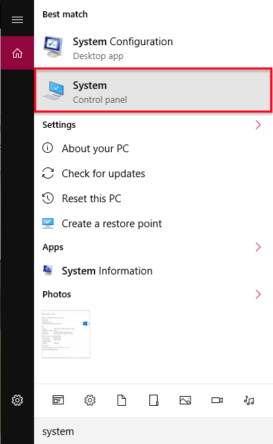
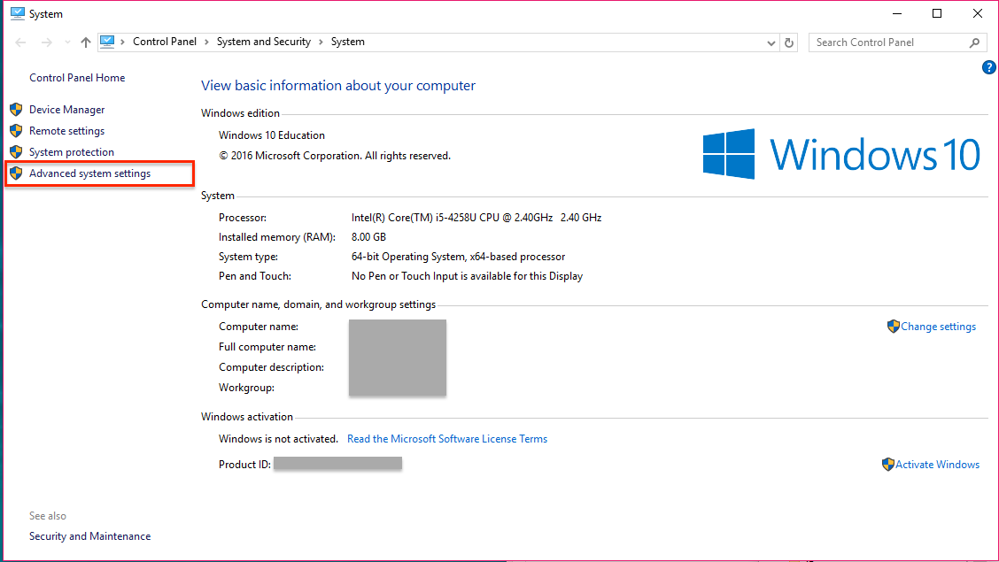
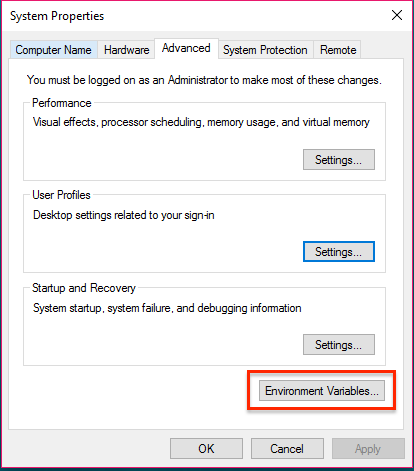
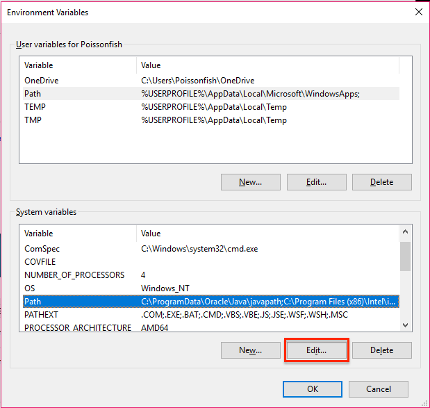
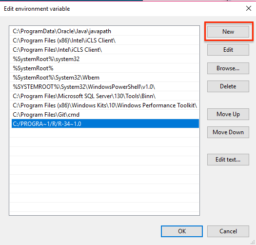

# Intelligent Prediction and Association Tool

<p align="center"></p>
<p align="center"></p>


## [Download iPat](http://zzlab.net/iPat/iPat.zip)
## [Demo data](http://zzlab.net/iPat/demo.zip)
## [User manual (pdf)](http://zzlab.net/iPat/iPat_manual.pdf)

# Table of Contents
#### 1. [Getting start](#get_start)
> 1-1 [Operation environment](#env)

> 1-2 [Windows users](#win)

> 1-3 [Mac OS users](#mac)

> 1-4 [Launch iPat](#launch)

#### 2. [Interface](#interface)
> 2-1 [Import files](#import_files)

> 2-2 [Create a project](#create_projects)

> 2-3 [File formats](#file_format)

> 2-4 [Covariates and kinship](#C_K)

> 2-5 [Define input arguments](#input)

> 2-6 [Run an analysis](#run)

> 2-7 [Check the results](#check)

> 2-8 [Files remove](#delete)

#### 3. [GWAS, GS and BSA](#gwas)
> 3-1 [GAPIT](#gapit)

> 3-2 [FarmCPU](#farm)

> 3.3 [PLINK](#plink)

> 3.4 [rrBLUP](#rrblup)

> 3.5 [BGLR](#bglr)

> 3.6 [BSA](#bsa) 

#### 4. [Support](#support)
#### 5. [Citation](#cite)


<br><br><br>

<a name="get_start"></a>
## 1. Getting start

<a name="env"></a>
### 1.1 Operation environment
* Before launching iPat, remember to place folder 'libs' to the directory where 'iPat.jar' exists. iPat can function normally only when both 'libs' and 'iPat.jar' are located in the same folder.
<p align="center"><p align="center"></p>

* The operation environment need to meet the following requirement:
	* Operation System: Windows and Mac OS X.
	* [Java Runtime Environment (JRE)](http://www.oracle.com/technetwork/java/javase/downloads/index.html): Version 8 or later.
	* [R](https://www.r-project.org): Version 3.4.0 or later. 

<a name="win"></a>
### 1.2 Windows users
* If you can call R from the commnad-line window (cmd.exe) by typing "R" or "r", then you can skip to section 1.4. Otherwise, please follow the instruction below to get your system compatible with iPat.

* Open R software, and type ```R.home("bin")``` in the console. It will return a path to the executable R. Copy this path to the clipboard.
<p align="center"><p align="center"></p>

* Search keyword "system" from Windows, and open "System".
<p align="center"><p align="center"></p>

* Then select "Advanced system settings" at the left side of the panel.
<p align="center"><p align="center"></p>

* And click "Environment Variable..." at the bottom-right area.
<p align="center"><p align="center"></p>

* The pop-up windows will display two set of system variables. Highligh the system variable "Path" at the bottom list, and click "Edit". 
<p align="center"><p align="center"></p>

* Almost there. Click "new" and paste the path you got from the clipboard, then click "OK" to save the configuration.
<p align="center"><p align="center"></p>

<a name="mac"></a>
### 1.3 Mac OS users
* For the users who run iPat on Mac OS, there's no need to do extra adjustment in your system.

<a name="launch"></a>
### 1.4 Launch iPat
* After setting up the required environment mentioned above, iPat is now ready to go. Double clicking on 'iPat.jar' to launch iPat.

<a name="interface"></a>
## 2. Interface

<a name="import_files"></a>
### 2.1 *Import files*
* At beginning, iPat will show nothing but an icon "iPat" at the top of screen. 

* Users can import files simply by dragging and dropping.

<p align="center"></p>

<a name="create_projects"></a>
### 2.2 *Create a project*
* After importing the files, double clicking on anywhere in iPat to create a new project (a gear icon).

* Build a project by dragging a files over the project icon. A dashline will be shown between the file and project, which mean this file has been already included in this project. 

<p align="center"></p>

* A valid project must include a certain number of required files (see the table in section 2.3), **no less, no more.** Otherwise iPat won't work and will return an error message.

<a name="file_format"></a>
### 2.3 *File formats*
* iPat can work fine with Hapmap, numerical, VCF and PLINK format, it will recognize the file format and do a format conversion automatically if needed.
 
* ***A fileset included in one project must have identical filenames and correct extension name if they need to be converted to a proper format.*** For example, if you want to perform GWAS using VCF format in FarmCPU, which is a package only support files in numerical format, the input fileset should be named as: **data.vcf** and **data.txt**. 

* The table below shows further information of valid datasets in different formats: 

<center>

|Format |File 1<br>(required)|File 2<br>(required)|File 3<br>(required)|File 4<br>(required)|
|:-:|:-:|:-:|:-:|:-:|
|Hapmap|Genotype<br>(.hmp)|Phenotype<br>(.txt)| None | None |
|Numeric|Genotype<br>(.dat)|Phenotype<br>(.txt)|Map information (.map)<br>(Only required for GWAS)| None |
|VCF   |Genotype<br>(.vcf)|Phenotype<br>(.txt)| None | None |
|PLINK<br>(binary)|Genotype<br>(.bed)|Phenotype<br>(.txt)|Map information (.bim)| Individual information<br>(.fam)|
|BSA|Reads count<br>(.bsa)|Map information<br>(.map)| None | None |

</center>

<a name="C_K"></a>
### 2.4 *Covariates and kinship*
* Users are allowed to add covariates into the project. Right clicking on the file can change the file type.

<p align="center"></p>

* Label “C” stands for covariate, and Label “K” is indicated as kinship.

<p align="center"></p>

<a name="input"></a>
### 2.5 *Define input arguments*
* After linking every files needed in the project, right click on the project to open a configuration panel.


* At the top of the panel, users can select a tool to perform GWAS or genomic prediction.  

* A hint will pop up for each argument when the cursor hovers over the arguments’ name.

<p align="center"></p>

<a name="run"></a>
### 2.6 *Run an analysis*
* After defining the analysis, user can start to run the procedure by clicking ‘GO’ at the top of the panel.

* Each task will generate a console window while running the analysis. User can track the progress of the task from window messages.

* iPat also capable of multitasking. Users can arrange another project even when the previous one have not done yet.

<p align="center"></p>

<a name="check"></a>
### 2.7 *Check the result*
* When iPat complete a project, the gear icon will show a green dot if the task run successfully without any error occurred. Otherwise it will show a red dot at its top-left to notify users that there’re existing at least one error message during the analysis.

<p align="center"></p>
* Users can check the result by double clicking on the gear icon, which will directe users to the folder where the output files generated.

<p align="center"></p>

<a name="delete"></a>
### 2.8 *Files remove*
* Users can remove objects and linkage by typing “Del” after selecting 

* For linkages, the line will become solid when it’s selected. 

* For objects, there will be a dashed line surrounded to indicate that the object is selected.

* Users can also drag the linkages or objects to the bottom-right corner, a hidden trashcan will show up for deletion.

<p align="center"></p>

<a name="gwas"></a>
## 3. GWAS and GS
Tools implemented in iPat allow users to do genome-wide associate study (GWAS) and genomic selection (GS). Curretly GWAS can be performed by GAPIT, FarmCPU and PLINK, and GS can be done by GAPIT and rrBLUP in iPat. Tables below are the input arguments available in iPat:

<a name="gapit"></a>
### 3.1 GAPIT
|Category|Parameters|	Definitions| Default|
|:--|:---|:---|:--:|
|Subset|Subset of traits data|Users can select all or partial of traits to be analyzed|All traits|
|Subset|Subset of chromosomes|Users can select all or partial of chromosomes to be analyzed|All
|Covariates|PCA.count|How many of PCs should be treated as covariates|3
|Covariates|Inheritable covariate|If there’s a user-input covariates, users can specify how many columns are inheritable.|All
|Quality control|By missing rate|Users can do a quality control on the marker set by missing rate.|NULL|
|Quality control|By MAF|Users can do a quality control on the marker set by minor allele frequency (MAF).|NULL
|GWAS|Model|Which linear model to use in GWAS |GLM
|GWAS|kinship.cluster|Clustering algorithm to group individuals based on their kinship|average
|GWAS|kinship.group|Method to derive kinship among groups|Mean
|GWAS|SNP.fraction|Fraction of SNPs Sampled to Estimate Kinship and PCs|1
|GWAS|File.fragment|The Fragment Size to Read Each Time within a File|512

<a name="farm"></a>
### 3.2 FarmCPU
|Category|Parameters|	Definitions| Default|
|:--|:---|:---|:--:|
|Subset|Subset of traits data|Users can select all or partial of traits to be analyzed|All traits|
|Subset|Subset of chromosomes|Users can select all or partial of chromosomes to be analyzed|All
|Covariates|PCA.count|How many of PCs should be treated as covariates|3
|Covariates|Inheritable covariate|If there’s a user-input covariates, users can specify how many columns are inheritable.|All
|Quality control|By missing rate|Users can do a quality control on the marker set by missing rate.|NULL|
|Quality control|By MAF|Users can do a quality control on the marker set by minor allele frequency (MAF).|NULL
|GWAS|method.bin|It uses fixed or optimized of possible QTN window size and number of possible QTNs selected into FarmCPU model.|static|
|GWAS|maxLoop|Maximum number of iterations allowed |10

<a name="plink"></a>
### 3.3 PLINK
|Category|Parameters|	Definitions| Default|
|:--|:---|:---|:--:|
|Subset|Subset of chromosomes|Users can select all or partial of chromosomes to be analyzed|All
|Quality control|By missing rate|Users can do a quality control on the marker set by missing rate.|NULL|
|Quality control|By MAF|Users can do a quality control on the marker set by minor allele frequency (MAF).|NULL
|GWAS|C.I.|The desired coverage for a confidence interval|0.95|

<a name="rrblup"></a>
### 3.4 rrBLUP
|Category|Parameters|	Definitions| Default|
|:--|:---|:---|:--:|
|Subset|Subset of traits data|Users can select all or partial of traits to be analyzed|All traits|

<a name="bglr"></a>
### 3.5 BGLR
|Category|Parameter| Definitions| Default|
|:--|:---|:---|:--:|
|Subset|Subset of traits data|Users can select all or partial of traits to be analyzed|All traits|
|BGLR|Number of iterations| Number of iterations|1200|
|BGLR|Burn-In| Iteration of burn-in|200|

<a name="bsa"></a>
### 3.6 BSA
|Category|Parameter| Definitions| Default|
|:--|:---|:---|:--:|
|BSA|Windows Size|A smoothing coefficient for G statistics|5KB|


<a name="support"></a>
## 4 Support
* If there is any difficulty on iPat, please leave your question in the page of [issue report](https://github.com/Poissonfish/iPat/issues).
* Or you can directly send an email to the author [James Chen](mailto:chun-peng.chen@wsu.edu)

<a name="cite"></a>
## 5 Citation
* Bradbury,P.J. et al. (2007) TASSEL: software for association mapping of complex traits in diverse samples. Bioinformatics, 23, 2633–2635.
* Endelman,J. (2011) Ridge regression and other kernels for genomic selection in the R package rrBLUP. Plant Genome, 4, 250–255.
* Kang,H.M. et al. (2008) Efficient control of population structure in model organism association mapping. Genetics, 178, 1709–1723.
* Liu,X. et al. (2016) Iterative Usage of Fixed and Random Effect Models for Powerful and Efficient Genome-Wide Association Studies. PLoS Genet., 12, e1005767.
* Purcell,S. et al. (2007) PLINK: A Tool Set for Whole-Genome Association and Population-Based Linkage Analyses. Am J Hum Genet, 81, 559–575.
* Tang,Y. et al. (2016) GAPIT Version 2: An Enhanced Integrated Tool for Genomic Association and Prediction. Plant J., 9.

