# Intelligent Prediction and Association Tool

<p align="center"></p>
<p align="center">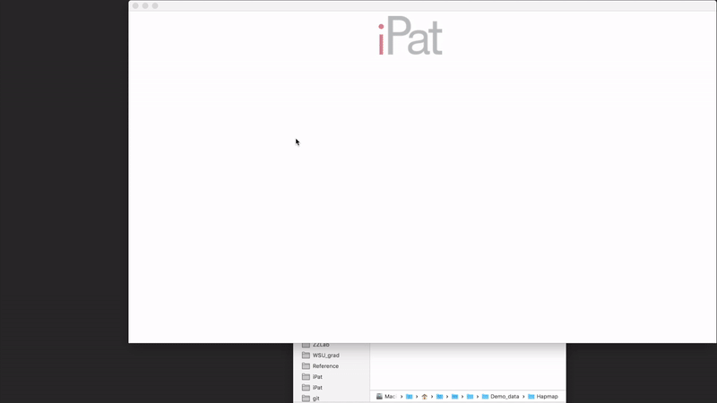</p>


## [Download iPat for Windows](http://zzlab.net/iPat/iPat.zip)
## [Download iPat for Mac OS](http://zzlab.net/iPat/iPat_Installer.dmg)
## [Demo data](http://zzlab.net/iPat/demo.zip)
## [User manual (pdf)](http://zzlab.net/iPat/iPat_manual.pdf)

# Table of Contents
#### 1. [Getting start](#get_start)
> 1-1 [Operation environment](#env)

> 1-2 [Windows users](#win)

> 1-3 [Mac OS users](#mac)

> 1-4 [Launch iPat](#launch)

#### 2. [Interface](#interface)
> 2-1 [Import files](#import_files)

> 2-2 [Create a project](#create_projects)

> 2-3 [File formats](#file_format)

>> 2.3.1 [Phenotype](#phenotype)

>> 2.3.2 [Hammap](#hmp)

>> 2.3.3 [Numeric](#num)

>> 2.3.4 [VCF](#vcf)

>> 2.3.5 [PLINK](#plink)

>> 2.3.6 [Binary PLINK] (#plinkb)

> 2-4 [Covariates and kinship](#C_K)

>> 2.4.1 [Add additional information to iPat](#add_ck)

>> 2.4.2 [Covariates](#cov)

>> 2.4.3 [Kinship](#kin)

> 2-5 [Define input arguments](#input)

> 2-6 [Run an analysis](#run)

> 2-7 [Check the results](#check)

> 2-8 [Files remove](#delete)

#### 3. [GWAS, GS](#gwas)
> 3-1 [GAPIT](#gapit)

> 3-2 [FarmCPU](#farm)

> 3.3 [PLINK](#plink)

> 3.4 [rrBLUP](#rrblup)

> 3.5 [BGLR](#bglr)

#### 4. [Support](#support)
#### 5. [Citation](#cite)


<br><br><br>

<a name="get_start"></a>
## 1. Getting start

<a name="env"></a>
### 1.1 Operation environment
* The operation environment need to meet the following requirement:
	* Operation System: Windows or Mac OS X .
	* [Java Runtime Environment (JRE)](http://www.oracle.com/technetwork/java/javase/downloads/index.html): Version 8 or later.
	* [R](https://www.r-project.org): Version 3.4.0 or later. 

<a name="win"></a>
### 1.2 Windows users

#### 1.2.1 Set up R environment
* If you can call R from the commnad-line window (cmd.exe) by typing "R" or "r", then you can skip to section 1.2.2. Otherwise, please follow the instruction below to get your system compatible with iPat.

* Open R software, and type ```R.home("bin")``` in the console. It will return a path to the executable R. Copy this path to the clipboard.
<p align="center"><p align="center">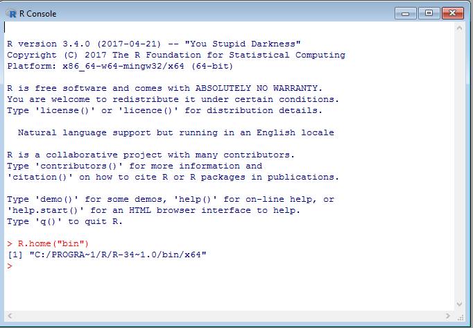</p>

* Search keyword "system" from Windows, and open "System".
<p align="center"><p align="center"></p>

* Then select "Advanced system settings" at the left side of the panel.
<p align="center"><p align="center">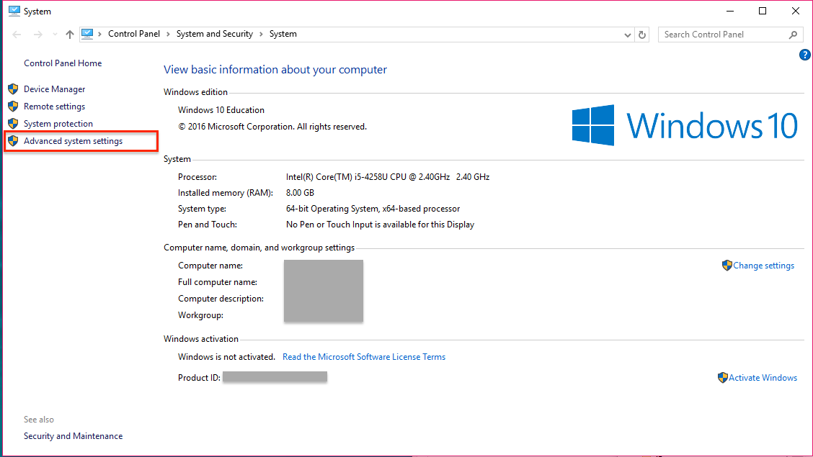</p>

* And click "Environment Variable..." at the bottom-right area.
<p align="center"><p align="center">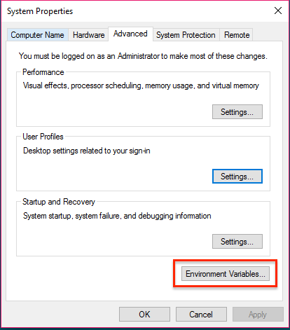</p>

* The pop-up windows will display two set of system variables. Highligh the system variable "Path" at the bottom list, and click "Edit". 
<p align="center"><p align="center"></p>

* Almost there. Click "new" and paste the path you got from the clipboard, then click "OK" to save the configuration.
<p align="center"><p align="center"></p>

#### 1.2.2 Extract iPat.exe from iPat.zip
* Download [iPat.zip](http://zzlab.net/iPat/iPat.zip) and decompress it. You will then get a folder named "iPat", which contains a executable file "iPat.exe" and a folder "libs".

* It's noted that users are alway required to place "iPat.exe" and the folder "libs" in the same folder (directory) so that iPat can function normally.
<p align="center"><p align="center">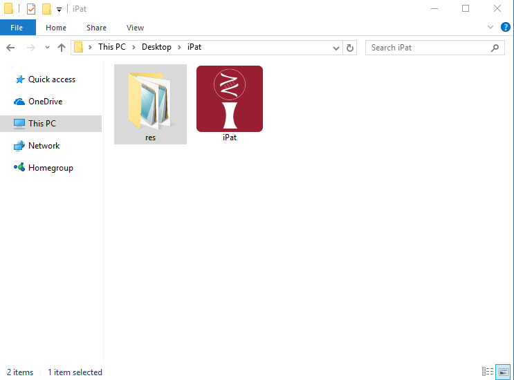</p>

* Double click 'iPat.exe' to launch iPat.

<a name="mac"></a>
### 1.3 Mac OS users
* Download [iPat_Installer.dmg](http://zzlab.net/iPat/iPat_Installer.dmg) and mount it on Mac. 

* Follow the instruction to install iPat.
<p align="center"><p align="center">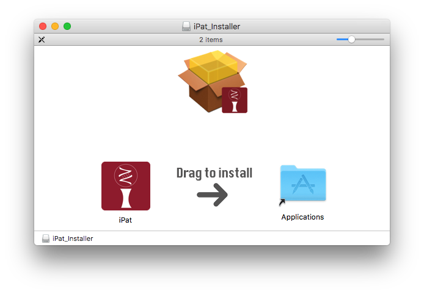</p>

* Double click 'iPat.app' to launch iPat.

<a name="interface"></a>
## 2. Interface

<a name="import_files"></a>
### 2.1 *Import files*
* At beginning, iPat will show nothing but an icon "iPat" at the top of screen. 

* Users can import files simply by dragging and dropping.

<p align="center">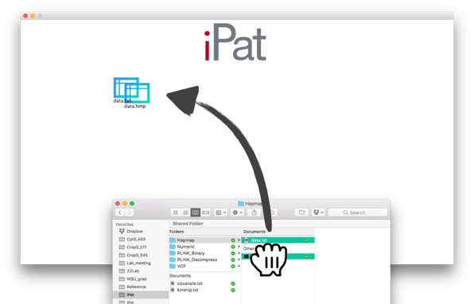</p>

<a name="create_projects"></a>
### 2.2 *Create a project*
* After importing the files, double clicking on anywhere in iPat to create a new project (a gear icon).

* Build a project by dragging a files over the project icon. A dashline will be shown between the file and project, which mean this file has been already included in this project. The below two are examples for a valid project. 

<p align="center">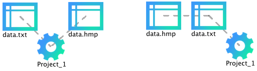</p>

* A valid project must include a certain number of required files, **no less, no more.** Otherwise iPat won't work and will return an error message. Valid datasets for each format can be found from the table below:

<center>

|Format |File 1<br>(required)|File 2<br>(required)|File 3<br>(required)|File 4<br>(required)|
|:-:|:-:|:-:|:-:|:-:|
|Hapmap|Genotype<br>(.hmp)|Phenotype<br>(.txt)| None | None |
|Numeric|Genotype<br>(.dat)|Phenotype<br>(.txt)|Map information (.map)<br>(Only required for GWAS)| None |
|VCF   |Genotype<br>(.vcf)|Phenotype<br>(.txt)| None | None |
|PLINK|Genotype<br>(.ped)|Phenotype<br>(.txt)|Map information (.map)| None |
|PLINK<br>(binary)|Genotype<br>(.bed)|Phenotype<br>(.txt)|Map information (.bim)| Individual information<br>(.fam)|

</center>

<a name="file_format"></a>
### 2.3 *File formats*
* iPat can work fine with Hapmap, numerical, VCF and PLINK format, it will recognize the file format and do a format conversion automatically if needed.
 
<a name="phenotype"></a>
#### 2.3.1 Phenotype
* Phenotype data for every formats except PLINK must contain **sample names** in the first column and **traits names** as the header: 

|taxa|trait 1|trait 2|
|:-:|:-:|:-:|
|sample1| 
|sample2|
|sample3|

* Phenotype data for PLINK must contain **sample and family names** in the first 2 columns and **traits names** as the header:

|FID|SID|trait 1|trait 2|
|:-:|:-:|:-:|:-:|
|family 1|sample1| 
|family 2|sample2|
|family 3|sample3|

<a name="hmp"></a>
#### 2.3.2 Hapmap
* Genotype data, the header is requried to be provided:

|rs| alleles| chrom|pos| strand|assembly| center| protLSID| assayLSID|panel| QCcode| sample 1| sample 2| sample 3|
|:-:|:-:|:-:|:-:|:-:|:-:|:-:|:-:|:-:|:-:|:-:|:-:|:-:|:-:|
|marker 1|A/C|1|157104|+|AGPv1|Panzea|NA|NA|maize282|NA|CC|CC|AA|
|marker 2|C/G|1|1947984|+|AGPv1|Panzea|NA|NA|maize282|NA|GG|GG|CC|

<a name="num"></a>
#### 2.3.3 Numeric
* Genotype data, samples are recorded in rows. The header and sample names can be omitted:

|taxa|marker 1|marker 2|marker 3|
|:-:|:-:|:-:|:-:|
|sample1|0|0|1|
|sample2|0|0|0|
|sample3|1|0|0

* Map information, the header is requried to be provided:

|SNP|Chromosome| Position|
|:-:|:-:|:-:|:-:|
|marker 1|1|157104|
|marker 2|1|1947984|
|marker 3|1|2914066|

<a name="vcf"></a>
#### 2.3.4 VCF
* Genotype data, the header is requried to be provided:

|CHROM| POS|ID|REF|ALT|QUAL|FILTER|INFO|FORMAT|sample 1| sample 2| sample 3|
|:-:|:-:|:-:|:-:|:-:|:-:|:-:|:-:|:-:|:-:|:-:|:-:|
|1|157104|marker 1|A|C|.|PASS|.|GT|0/0|1/1|0/0|
|1|1947984|marker 2|C|G|.|PASS|.|GT|0/0|1/1|1/1|

<a name="plink"></a> 
#### 2.3.5 PLINK (the header should be removed)
* Genotype data (.ped). Missing value can be filled as "0":

|Family ID|Sample ID|Paternal ID|Maternal ID|Sex|Affection|marker 1|marker 2|marker 3|
|:-:|:-:|:-:|:-:|:-:|:-:|:-:|:-:|:-:|
|FAM1|NA06985|0|0|1|1|A A|T T|A A|
|FAM1|NA06991|0|0|1|1|A A|T T|A A|
|0|NA06993|0|0|1|1|C T|C C|T T|

* Map information (.map):

|Chromosome|Marker ID|Genetic distance|Physical Position|
|:-:|:-:|:-:|:-:|:-:|
|1|marker 1|0|157104|
|1|marker 2|0|1947984|
|1|marker 3|0|2914066|

<a name="plinkb"></a> 
#### 2.3.6 Binary PLINK (the header should be removed)
* Genotype data (.bed): 
	
	Please follow the instruction from [here](http://www.cog-genomics.org/plink2/formats#bed)

* FAM file:

|Family ID|Sample ID|Paternal ID|Maternal ID|Sex|Affection|
|:-:|:-:|:-:|:-:|:-:|:-:|
|FAM1|NA06985|0|0|1|1|
|FAM1|NA06991|0|0|1|1|

* BIM file:

|Chromosome|Marker ID|Genetic distance|Physical Position|Allele 1|Allele 2|
|:-:|:-:|:-:|:-:|:-:|:-:|
|1|marker 1|0|157104|A|C|
|1|marker 2|0|1947984|A|T|


<a name="C_K"></a>
### 2.4 *Covariates and kinship*

<a name="add_ck"></a>
#### 2.4.1 Add additional information to iPat
* Covariates provided by users will be treated as **fixed effect** in the selected model except in BGLR. 

* It's **optional** that users can add **user-define** covariates or kinship into the project. Right clicking on the file to tell iPat what type of file it is. (i.e. covariates, kinship or a basic required file)

<p align="center">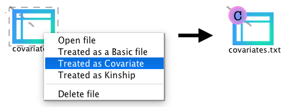</p>

* Be aware that apart from the basic required file (i.e. phenotype and genotype), optional files must be properly labeled in a project.

<p align="center">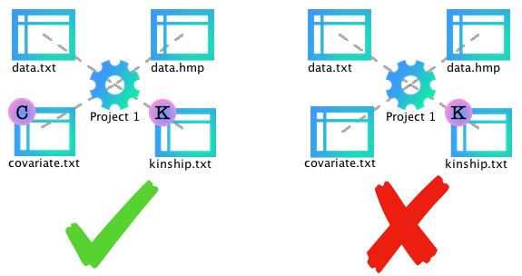</p>


* The file labeled “C” stands for a covariate file, while files labeled “K” is identified as a kinship file by iPat. For the example of a valid project below (Left one), the file "covariate.txt" and "kinship.txt" are treated as covariates and a kinship in this project, respectively. Each project can contain **one** covariate files and **one** single kinship.

<a name="cov"></a>
#### 2.4.2 Covariates
* Demo format for a covarate file. The header is required to be provided:

|PC1|PC2|PC3|
|:-:|:-:|:-:|
|-1.8942149|-4.91532916|0.8674568|
|1.6858820|-5.08378277|-0.4069675|
|0.2579269|-6.29547725|2.6867939|

<a name="kin"></a>
#### 2.4.3 Kinship

* Demo format for a kinship file. Taxa name is required while the header can be omitted:

|taxa|sample 1|sample 2|sample 3|
|:-:|:-:|:-:|:-:|:-:|
|sample 1|2.00000000| 0.22883683| 0.22932180|0.26884221|
|sample 2| 0.22883683|2.00000000|0.24496455|0.29370841|
|sample 3|0.22932180 | 0.24496455 | 2.00000000 | 0.21485867 |

* If there is no user-define kinship, a kinship will be generated by the selected package:

<center>

|Package|Kinship algorithm|
|:--:|:---:|
|GAPIT|VanRaden (VanRaden, 2008),  <br> Loiselle (Loiselle *et al.*, 1995) <br> or EMMA (Kang *et al.*, 2008)|
|FarmCPU|FARM-CPU (Liu *et al.*, 2016)|
|PLINK|User-provided|
|rrBLUP|VanRaden (VanRaden, 2008)|
|BGLR|User-provided|

</center>


<a name="input"></a>
### 2.5 *Define Your Analysis*
* After linking every files needed in the project, right click on the project and choose either GWAS or GS to open a configuration panel.

<p align="center">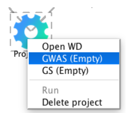</p>

* The panel consist of two sections. The upper one presents a set of input arguments shared by all methods, while users can define method-specific arguments from the lower section.
 
<p align="center">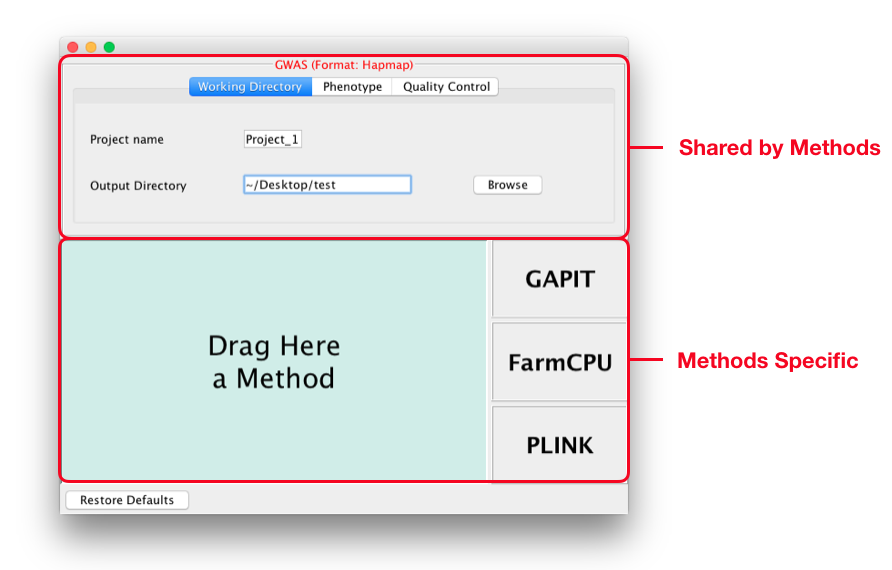</p>

* Available parameters in the upper section : 

<center>

|Tab|Parameters|Definition|Default|
|:-:|:--|:--|:--|
|Working Directory|Project name|Prefix for output files|Project_x (x is a number starts from 1)|
|Working Directory|Output Directory|A path where output files will be generated|Home directory|
|Phenotype|Trait names|Subsetting traits data|All traits are selected|
|Quality Control|By missing rate|Filtering out markers where certain rate of value is missing|No threshold|
|Quality Control|By MAF|Filtering out markers based on minor allele frequency|0.05|
 
</center>

* To select a method, simply drag a "method block" to the left-side area. And tap on this area for further defining (The information of method-specific arguments can be found in the section 3) . 

<p align="center">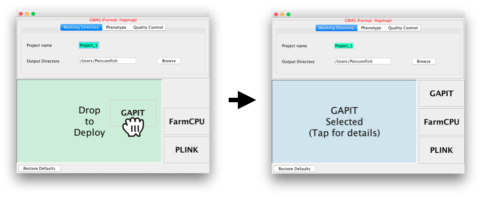</p>

* After defining the analysis, user can start to run the procedure by clicking ‘Run’ at the pop-up menu of the project.

<p align="center">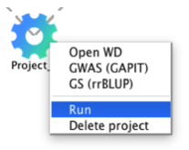</p>

 
<a name="run"></a>
### 2.6 *Run an analysis*
* In iPat, users are allowed to do genomic studies such as GWAS, GS and GWAS-Assisted GS (Associated SNPs reported by GWAS will be treated as fixed effect in GS). iPat will detect the project configuration and decide which analysis should be implemented afterward.

<p align="center">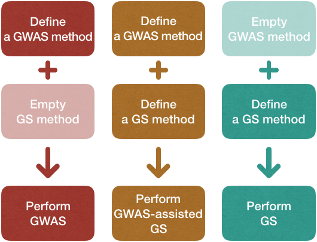</p>


* Each project will generate a console window while running the analysis. User can track the progress of the task from window messages.

* iPat also capable of multitasking. Users can arrange another project even when the previous one have not done yet.

<p align="center">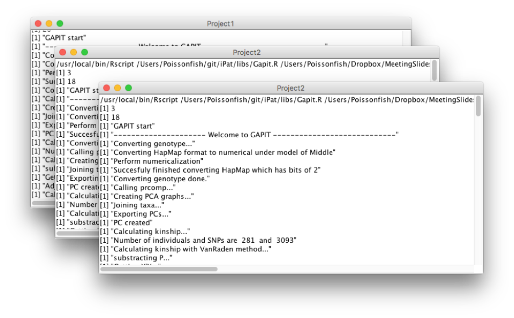</p>

<a name="check"></a>
### 2.7 *Inspect the result*
* When iPat complete a project, the gear icon will show a green dot if the task run successfully without any error occurred. Otherwise it will show a red dot at its top-left to notify users that there’re existing at least one error message during the analysis.

<p align="center">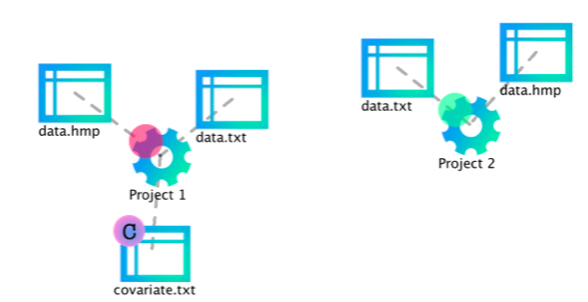</p>
* Users can inspect the results by double clicking on the gear icon, which will direct users to the folder where output files generated.

<p align="center">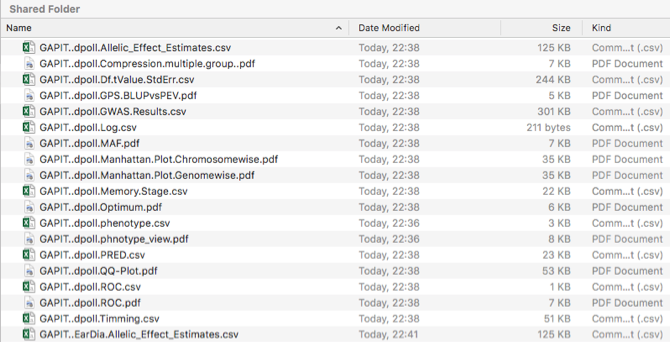</p>

<a name="delete"></a>
### 2.8 *Remove files from iPat*
* Users are allowed to remove projects or files from iPat in the pop-up menu through right clicking on them, or simply press <kbd>Backspace</kbd> (press <kbd>delete</kbd> on Mac) after selecting them.

<p align="center">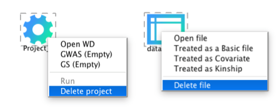</p>

<a name="gwas"></a>
## 3. GWAS and GS
Tools implemented in iPat allow users to do genome-wide associate study (GWAS) and genomic selection (GS). Curretly GWAS can be performed by GAPIT, FarmCPU and PLINK, and GS can be done by GAPIT, rrBLUP and BGLR in iPat. Tables below are the input arguments available in iPat:

<a name="gapit"></a>
### 3.1 GAPIT
|Tab|Parameters|	Definitions| Default|
|:--|:---|:---|:--:|
|Covariates|Covaraite names|Subsetting covaraites data|All covariates are selected| 
|GAPIT input|Model|Which linear model to be used in GWAS |GLM
|GAPIT input|kinship.cluster|Clustering algorithm to group individuals based on their kinship|average
|GAPIT input|kinship.group|Method to derive kinship among groups|Mean
|Advance|SNP.fraction|Fraction of SNPs Sampled to Estimate Kinship and PCs|1
|Advance|File.fragment|The Fragment Size to Read Each Time within a File|512
|Advance|Model selection|Conduct Bayesian information criterion (BIC)-based model selection to find the optimal number of PCs for inclusion in the GWAS models|FALSE|

<a name="farm"></a>
### 3.2 FarmCPU
|Category|Parameters|Definitions| Default|
|:--|:---|:---|:--:|
|Covariates|Covaraite names|Subsetting covaraites data|All covariates are selected|
|FarmCPU inpute|method.bin|It uses fixed or optimized of possible QTN window size and number of possible QTNs selected into FarmCPU model.|static|
|FarmCPU inpute|maxLoop|Maximum number of iterations allowed |10

<a name="plink"></a>
### 3.3 PLINK
|Category|Parameters|Definitions| Default|
|:--|:---|:---|:--:|
|Covariates|Covaraite names|Subsetting covaraites data|All covariates are selected|
|PLINK input|C.I.|The desired coverage for a confidence interval|0.95|

<a name="rrblup"></a>
### 3.4 rrBLUP
|Category|Parameters|Definitions| Default|
|:--|:---|:---|:--:|
|Covariates|Covaraite names|Subsetting covaraites data|All covariates are selected|
|rrBLUP input|Shrinkage estimation|Shrinkage estimation can improve the accuracy of genome-wide marker-assisted selection, particularly at low marker density (Endelman and Jannink 2012)||
|rrBLUP input|impute.method|Imputation algorithm for missing values in markers data|mean|

<a name="bglr"></a>
### 3.5 BGLR
|Category|Parameter| Definitions| Default|
|:--|:---|:---|:--:|
|Subset|Subset of traits data|Users can select all or partial of traits to be analyzed|All traits|
|BGLR|Regression model for predictor (Markers) |The regression type for the markers data|BRR|
|BGLR|response_type|Data type of the response (y) |gaussian|
|BGLR|nIter| The number of iterations of the sampler|1200|
|BGLR|burnIn| The number of samples discarded|200|
|BGLR|thin| The number of thinning|5|

<a name="support"></a>
## 4 Support
* If there is any difficulty on iPat, please leave your question in the page of [issue report](https://github.com/Poissonfish/iPat/issues).
* Or you can directly send an email to the author [James Chen](mailto:chun-peng.chen@wsu.edu)

<a name="cite"></a>
## 5 Citation
* Bradbury,P.J. et al. (2007) TASSEL: software for association mapping of complex traits in diverse samples. Bioinformatics, 23, 2633–2635.
* Endelman,J. (2011) Ridge regression and other kernels for genomic selection in the R package rrBLUP. Plant Genome, 4, 250–255.
* Kang,H.M. et al. (2008) Efficient control of population structure in model organism association mapping. Genetics, 178, 1709–1723.
* Liu,X. et al. (2016) Iterative Usage of Fixed and Random Effect Models for Powerful and Efficient Genome-Wide Association Studies. PLoS Genet., 12, e1005767.
* Purcell,S. et al. (2007) PLINK: A Tool Set for Whole-Genome Association and Population-Based Linkage Analyses. Am J Hum Genet, 81, 559–575.
* Tang,Y. et al. (2016) GAPIT Version 2: An Enhanced Integrated Tool for Genomic Association and Prediction. Plant J., 9.

