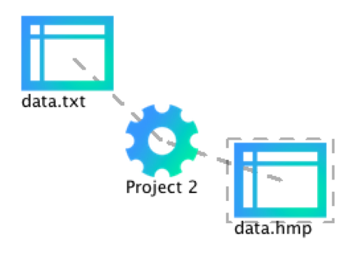
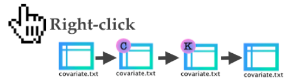
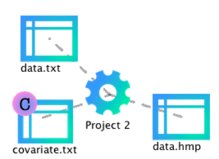
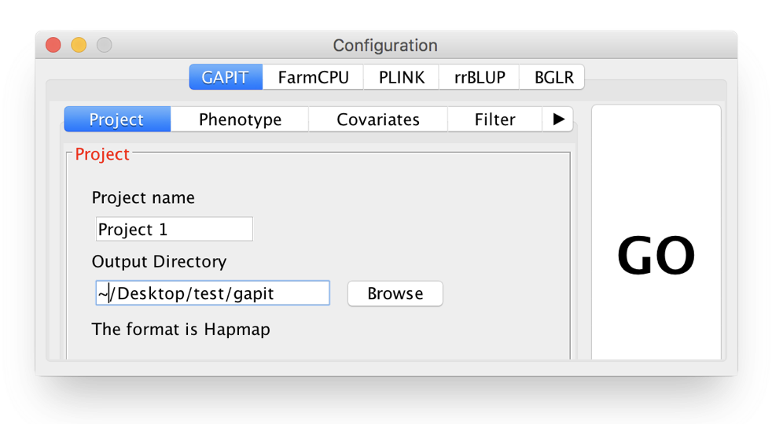
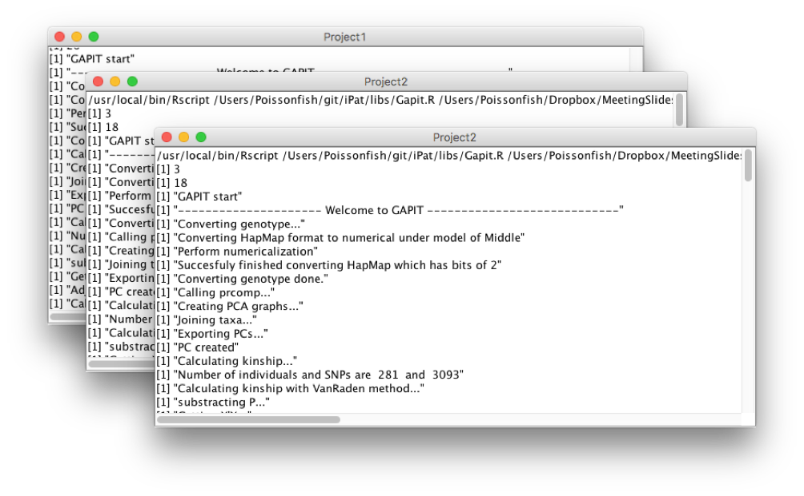
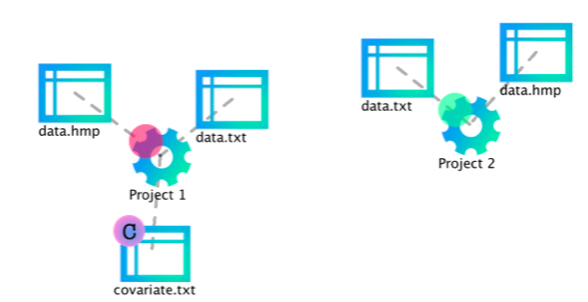

<h1 style="text-align:center">User Manual for</h1>

<h1 style="text-align:center">Intelligent Prediction and Association Tool</h1>

<h3 style="text-align:center">(Version 1.1)</h3>
<h3 style="text-align:center">Last updated on Apr 24, 2017</h3>

<h3>abc</h3>

abc

   

# Table of Contents
#### 1. [Getting start](#get_start)
#### 2. [Interface](#interface)
> 2-1 [Import files](#import_files)

> 2-2 [Create a project](#create_projects)

> 2-3 [File formats](#file_format)

> 2-4 [Covariates and kinship](#C_K)

> 2-5 [Define input arguments](#input)

> 2-6 [Run an analysis](#run)

> 2-7 [Check the results](#check)

> 2-8 [Files remove](#delete)

#### 3. [GWAS and GS](#Gwas)

   

## 1. Getting start 
* Before launching iPat, remember to place folder 'libs' to the path where 'iPat.jar' exists. iPat can function normally only when it is in the same folder as ‘libs’.

* The operation environment need to meet the following requirement:
	* Operation System: Mac OS X.
	* [Java Runtime Environment (JRE)](http://www.oracle.com/technetwork/java/javase/downloads/index.html): Version 8 or later.
	* [R](https://www.r-project.org): Version 3.4.0 or later. 

* After set up all the thing mentioned previously, iPat is now ready to go. Double-click on 'iPat.jar' to launch iPat.

## 2. Interface

### 2.1 *Import files*
* At beginning, iPat will show nothing but an icon "iPat" at the top of screen. 

* Users can import files simply by dragging and dropping.

### 2.2 *Create a project*
* After importing the files, double clicking on anywhere in iPat to create a new project.

* Build linkages between this project and all the files planed to be analyzed. A linkage can be built by dragging one object over one another.

### 2.3 *File formats*
* iPat can recognize and work fine with different formats, which include hapmap, numeric, vcf and plink.

* ***Imported file set need to have identical names and correct extension name if they need to be converted to a proper format.*** For example, if you want to perform GWAS using VCF format in FarmCPU, files set should be named as: data.vcf and data.txt. The table below shows examples of files and its extension name for the corresponded format:

|Format |Genotype|Phenotype|Other information|
|:-----:|:------:|:-------:|:---------------:|
|Hapmap |.hmp    |.txt     |None  	        |  
|Numeric|.dat    |.txt     |.map 			     |
|VCF    |.vcf    |.txt     |None             |
|PLINK  |.bed    |.txt     |.fam .bim        |




### 2.4 *Covariates and kinship*
* Users are allowed to add covariates into the project. Right clicking on the file can change the file type.



* Label “C” stands for covariate, and Label “K” is indicated as kinship.


### 2.5 *Define input arguments*
* After linking every files needed in the project, right click on the project to open a configuration panel.


* At the top of the panel, users can select a tool to perform GWAS or genomic prediction.  

* A hint will pop up for each argument when the cursor hovers over the arguments’ name.


### 2.6 *Run an analysis*
* After defining the analysis, user can start to run the procedure by clicking ‘GO’ at the top of the panel.

* Each task will generate a console window while running the analysis. User can track the progress of the task from window messages.

* iPat also capable of multitasking. Users can arrange another project even when the previous one have not done yet.


### 2.7 *Check the result*
* When iPat complete a project, the gear icon will show a green dot if the task run successfully without any error occurred. Otherwise it will show a red dot at its top-left to notify users that there’re existing at least one error message during the analysis.


* Users can check the result by double clicking on the gear icon, which will directe users to the folder where the output files generated.


### 2.8 *Files remove*
* Users can remove objects and linkage by typing in “Del” after selecting 

* For linkages, the line will become solid when it’s selected. 

* For objects, there will be a dashed line surrounded to indicate that the object is selected.

* Users can also drag the linkages or objects to the bottom-right corner, a hidden trashcan will show up for deletion.






